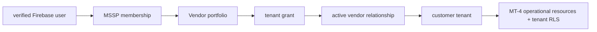
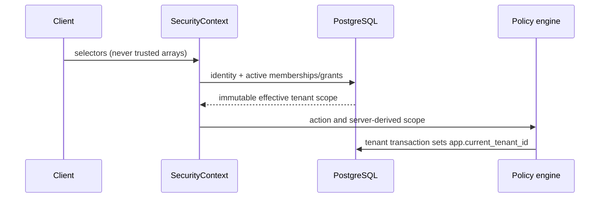

# MT-5 MSSP portfolio authorization

MT-5 adds a narrow, PostgreSQL-backed boundary for a vendor (MSSP) operating
customer organizations. It does not move operational data out of tenant
tables.

Relationships require a `VENDOR` and `CUSTOMER`, cannot self-reference, and
carry lifecycle and effective dates. Portfolios can only be owned by their
vendor. Organization grants include customer tenants that existed when the
grant was created, but do not implicitly grant newly-created tenants:
`allow_future_tenants` defaults to false. A tenant grant is explicit and must match
the portfolio vendor,
customer organization, relationship, and tenant organization.

MSSP memberships are scoped to one portfolio and have independent roles and
dates. Alpha and Beta portfolios therefore remain independent even when they
serve the same tenant. The runtime role remains `NOBYPASSRLS`; MT-4 resources
retain their existing forced tenant RLS. Authorization metadata is not a
tenant-data access path, and audit writes are intended for a controlled
server-side writer.

## Authorization decision audit boundary

Migration `004_authorization_audit_boundary.sql` makes
`explainsec_authorization_audit` append-only. The application runtime role has
no table privileges and can only execute `fn_record_authorization_decision`.
That `SECURITY DEFINER` function is owned by the pre-created,
`NOLOGIN`/`NOBYPASSRLS` role `explainsec_audit_writer`, uses a fixed
`search_path`, and validates the server-derived identity, membership, scope,
relationship, action/permission pair, policy identifier, and resource.

Tenant-scoped decisions must be recorded inside the same transaction as the
protected operation, after `SET LOCAL app.current_tenant_id`. The function
derives `tenant_id` from that transaction-local setting; it never accepts a
tenant ID from the application envelope. Organization, portfolio, and platform
events must not carry tenant context. Audit failures fail the surrounding
transaction and must not convert a denial into an allow.

The migration requires `explainsec_audit_writer` to be created before it runs
with `NOLOGIN`, `NOSUPERUSER`, `NOCREATEDB`, `NOCREATEROLE`, and
`NOBYPASSRLS`. The controlled migration identity must be a member of that role:
PostgreSQL ownership transfer requires explicit membership in the target owner
role; `CREATEROLE` alone is not sufficient. The migration identity is the only
identity that may create `explainsec_runtime` through migration 001, and the
runtime role is never made a member or owner of the audit writer role.

Migration 004 preserves pre-existing MT-5 audit rows whose `scope_type` is
NULL. Those historical rows remain explicitly unclassified; the migration does
not fabricate TENANT, ORGANIZATION, PORTFOLIO, or PLATFORM evidence. New rows
written through the controlled function always have a validated scope.

For portfolio-scoped decisions, the function additionally requires an active,
effective MT-5 organization-level portfolio grant linking the supplied
portfolio, vendor/customer organizations, and relationship. Portfolio-wide
events do not receive a tenant ID. Tenant-specific evidence remains a future
extension of the application call path and must use an explicit tenant grant
when applicable.

The integration test uses the admin fixture connection to remove only its own
audit rows after assertions, temporarily disabling user triggers for cleanup
and immediately re-enabling them. It then removes the fixture identity. This
does not grant the runtime role cleanup privileges and does not weaken
production append-only behavior.

**Repository verified:** SQL ordering, role preflight checks, privilege
boundaries, scope validation, and test cleanup strategy. **Cloud SQL
unverified:** managed-role ownership transfer, forced-RLS behavior for the
non-bypass function owner, pgcrypto availability, and private-IP/TLS
connectivity.

## Deferred areas

Firestore migration, dashboards, production-data migration, break-glass
access, full delegation, automated response, and MT-6 capabilities are
explicitly deferred. Grant-management APIs and an organization-level
administrative UI are also deferred; the repository/service boundary is the
server integration point for those future APIs.
